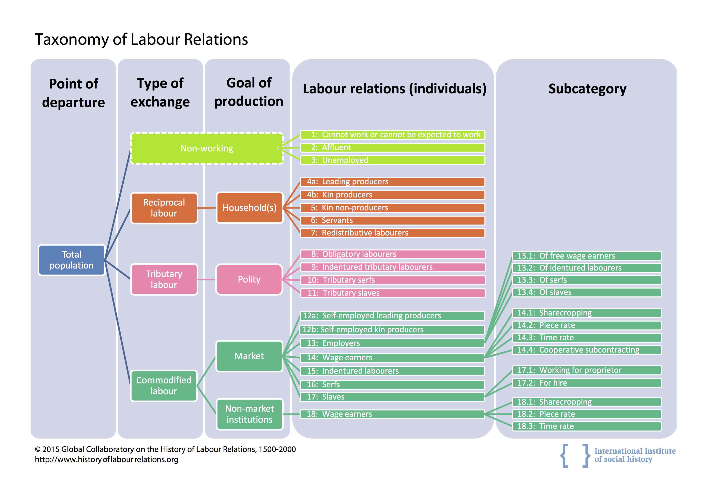

# Self-employment in historical macro-micro perspective

*January 27-29, 2016*

*Global Collaboratory on the History of Labour Relations Workshop*

*International Institute of Social History, Amsterdam*

## Introduction
The Global Collaboratory on the History of Labour Relations is organizing a series of workshops on shifting labour relations, here defined as for or with whom one works[^fn], in the world over the past five centuries. This workshop is the fourth in the series and focuses on shifts in and out of self-employment. Self-employment is an interesting labour relation, as self-employment allows people to earn a living, while to a large extent surpassing (im)plicit expectations about, for example, educational training and past experience, that usually are required to obtain a position on the labour market. While in some instances self-employment is intentional, not seldom self-employment is the result of exclusion from the labour market, for example due to sex, ethnicity or religion. Nevertheless in both the voluntary and involuntary case, self-employment provides access to means of living when regulated access to the labour market is impaired by respectively (in)formal exclusion or personal preferences.

The advantage of self-employment, avoiding (in)formal regulations to attain access to means of living, is juxtaposed with the disadvantage of not being able to call on the benefits that such regulations provide. Part of the current debate on the increasing number of self-employed focuses on their relatively deprived positions, as self-employed are less likely to afford mortgages or pension plans, a result of their unregulated and therefore unsecure labour market position. But also in societies where reciprocal labour was common, detachment of the household might have allowed for new opportunities due to a decrease in informal obligations to that household, while imposing new risks, as securities that were provided by the household, such as food and shelter, could no longer be called upon. Thus, it appears likely that in every society, self-employment as a way to escape (in)formal regulations is juxtaposed with the lack of security that such regulations provide. 

In comparative studies of the evolution of labour relations in the West and the Global South, self-employment appears to become a critical turning point. In the United States and Western Europe labour relations gradually shifted from reciprocal, tributary and unfree labour towards wage labour, the latter partially dissolving into self-employment only in the late twentieth / early twenty-first century. Traditionally the Global South has been expected to follow this pattern. During the period of colonization wage labour intensified following a Western pattern, but much earlier than in the West self-employment in the Global South started to increase again. Thus the trend towards self-employment in the West is now following up on the trend in the Global South. It is the mechanisms behind a reverse in trends like this, that the Global Collaboratory of the History of Labour Relations is interested in describing and explaining using the taxonomy.

For their study the Global Collaboratory on the History of Labour Relations uses a taxonomy to distinguish between 19 different labour relations (see Figure 1). It is important to note that *non-working* are also included as a category. By doing so, researchers are urged to think about the labour relations of all of the populations, rather than to come up with an isolated estimate of a particular type of work. That is, based on new historical materials it might be compelling to argue that the proportion of people working for the market was much larger, but by looking at the entire population the researcher is triggered to also answer the question from which part of the population the additional market oriented labour is coming. Among the 19 labour relations, self-employed are represented in group 12a 'Self-employed leading producers' and 12b 'Self-employed kin producers'. Self-employed leading producers are those who produce goods or services for the market, while having three or less employees. When these employees are household members of the self-employed leading producer, they are considered to be self-employed kin producers. (Non-related employees are considered as wage earners for the market (14)). 

The workshop at hand focuses on explaining what circumstances at the macro level (national, regional, city, social networks) and what characteristics on the individual level create opportunties and barriers for the push into or out of self-employment. By using historical data we are able describe long term patterns in self-employment and moreover to test the universality of mechanisms found in contemporary research. Workshop participants may for example focus on how government regulation or crises, may push or pull people into self-employment. As an example one could think of the midwives in the US that were pushed out of self-employment due to regulation of the profession of midwive. As another example, one could look at the *timing* of such government regulations within the life course and how they affected the push out of self-employment differently at differente ages. To study such mechanisms in self-employment from a historical perspective we propose 5 different sessions representing a descending level of abstraction (see table 1).

| Session   | Topic                                              |
| ----------| -------------------------------------------------- |
| Session 1 | Mechanisms of shifts in and out of self-employment |
| Session 2 | Macro: shifts in labour relations	                 |
| Session 3 | Micro: shifts in labour relations                  |
| Session 4 | Social structures of self-employment               |
| Session 5 | Self-employed as a life-course strategy            | 

The first session focuses on the theoretical underpinnnings of self-employment. It highlights many of the mechanisms related to the juxtaposition of good and bad outcomes as a result of lack of (in)formal rules regarding self-employment. We invite speakers to mostly focus on mechanisms that have been discerned in demographic, economic, geographic political or social domains. Substantively, such mechanisms might explain differences between rural and urban settings, sex-differences in labour relations. In addition, we much welcome studies on mechanisms behind shifts in labour relations either directly, or indirectly through temporal occupation of multiple labour relations.

The second and third session focus on self-employment as an outcome on respectively the macro or micro level. Since historical data often lack the detail to make inferences about individuals, studies focusing on how national or regional averages in self-employment fluctuate are welcomed in session 2. We very much welcome contributions that compare several countries or regions, especially if such a comparison is made over time. For session 3, we invite studies that focus on shifts in the influence of mechanisms leading to self-employment. For example, whether the importance of economic or social capital changes over time. While in session 3 the outcome variable should be on the individual level, determinants may be on any level. In that sense, we especially welcome studies that study the interplay of macro and micro determinants of self-employment. As an example of such a study, one could think of how state regulation affects the influence of age or sex on self-employment

Session four and five are specific instances of respectively session two and three. In session 4 the focus is on how social structures, on whatever macro level (country, region, social network) influences self-employment. We invite researchers to make clear and concise hypotheses, possibly combining several theories to derive and test hypotheses. To illustrate, religious affiliation is linked to social group norms and social structure. These also include norms on work ethic, for example on norms of female labour force participation. Paper givers might focus on how differences between religious groups, or changes in religious affiliation over time, may affect self-employment choices for women or other social groups. Session 5 focus on a particular micro-level phenonomenon namely varying levels of exposure to self-employment over the life-course. Here the idea is to study to study changes in the age at which people go into, or out of self-employment, for example, due to by-employment at the age of retirement.

| Time        |                                            Title       | Topic (cross-national = Western)        |
| ------------|--------------------------------------------------------|-----------------------------------------|
| 12.30-14.00 | Welcoming lunch                                        |                                         |
| 14.00-14.15 | Introduction to the workshop                           |                                         |
| Session 1:  | **Mechanisms of shifts in and out of self-employment** |                                         |
|             |                                                        |                                         |
| 14.15-15.00 | Blanchflower                                           | Contemporary cross-national comparisons |
|             |                                                        |                                         |
| 15.00-15.45 | Hofmeester / Lucassen                                  | 1500-2000 global shifts                 |
|             |                                                        |                                         |
| 16.00-16.45 | Bögenhold & Staber                                     | Contemporary cross-national comparisons |
|             |                                                        |                                         |
| 16.45-17.30 | Moore / Mueller                                        | Canada 1990's push factors              | 
| 18.00 -     | Drinks and dinner                                      |                                         | 
| Session 2:  | **Macro: shifts in labour relations**                  |                                         | 
|             |                                                        |                                         |
| 09.15-09.30 | Coffee                                                 |                                         | 
|             |                                                        |                                         |
| 09.30-10.15 | Caracausi                                              | Early modern mediterran                 | 
|             |                                                        |                                         |
| 10.15-11.00 | Dawson                                                 | UK, regional comparison, 1999-2000      | 
|             |                                                        |                                         |
| 11.45-13.00 | Fritsch & Wyrwich                                      | Germany, regions, long 20th century     | 
| 13.00-14.00 | Lunch                                                  |                                         | 
| Session 3:  | **Micro: shifts in labour relations**                  |                                         | 
|             |                                                        |                                         |
| 14.00-14.45 | Kessler                                                | Russia, 1700-2000                       |
|             |                                                        |                                         |
| 14.45-15.30 | Ajayi-Obe &  Parker                                    | UK 1990, BHPS, detailed individual data | 
| 15.30-16.00 | Coffee                                                 |                                         | 
| Session 4:  | **Self-employed as a life-course strategy**            |                                         | 
|             |                                                        |                                         |
| 16.00-17.15 | Carroll & Mosakowski                                   | West-Germany, firms,family spells 1960  | 
|             |                                                        |                                         |
| 17.15-18.00 | Zijdeman & Stapel?                                     | US, long 20th century, households       | 
| 19.00 -     | Conference dinner                                      |                                         | 
| Session 5   | **Social structures of self-employment**               |                                         | 
|             |                                                        |                                         |
| 09.15-09.30 | Coffee                                                 |                                         | 
|             |                                                        |                                         |
| 09.30-10.15 | Junfu Zhang (USA) juzhang@clarku.edu                   | China, 2009-2014, social networks       | 
|             |                                                        |                                         |
| 10.15-11.00 | Jan Lucassen – Lipper data                             | Germany, 1 city, long 18th century      | 
|             |                                                        |                                         |
| 11.45-13.00 | W. David Allen (USA, Huntsvill)                        | US, 1 city, ca. 2000, detailed context  | 
| 13.00-13.30 | Plenary discussion and conclusions                     |                                         |
|             |                                                        |                                         |
| 13.30-14.30 | Lunch and good bye                                     |                                         | 

[^fn]: Labour relations define for or with whom one works and under what rules. These rules (implicit or explicit, written or unwritten) determine the type of work, type and amount of remuneration, working hours, degrees of physical and psychological strain, as well as the degree of freedom and autonomy associated with the work.
